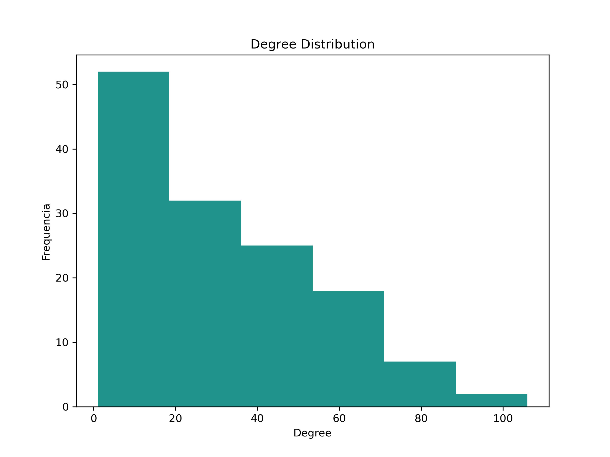
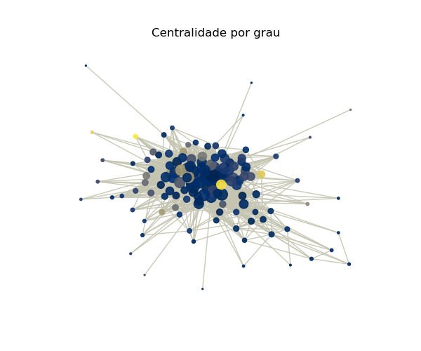
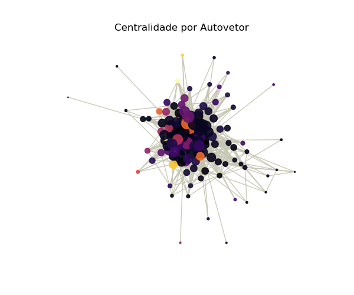

# Caracterização topológica de redes sociais

## Descrição da rede
O grafo utilizado foi retirado da plataforma SNAP (McAuley and Leskovec, 2012), e consiste em uma rede social retirada do X (antigo Twitter, atual antigo-twiter).  Os dados foram anonimizados, retirando-se o ID identificador do perfil real, foto de perfil etc.   

## Estatísticas básicas

## Distribuição de Graus

## Plot da Rede
### Centralidade por Grau
Também conhecido como “Coeficiente de Clustering”. 

### Centralidade por Autovetor

## Referências 
J. McAuley and J. Leskovec. Learning to Discover Social Circles in Ego Networks. NIPS, 2012.